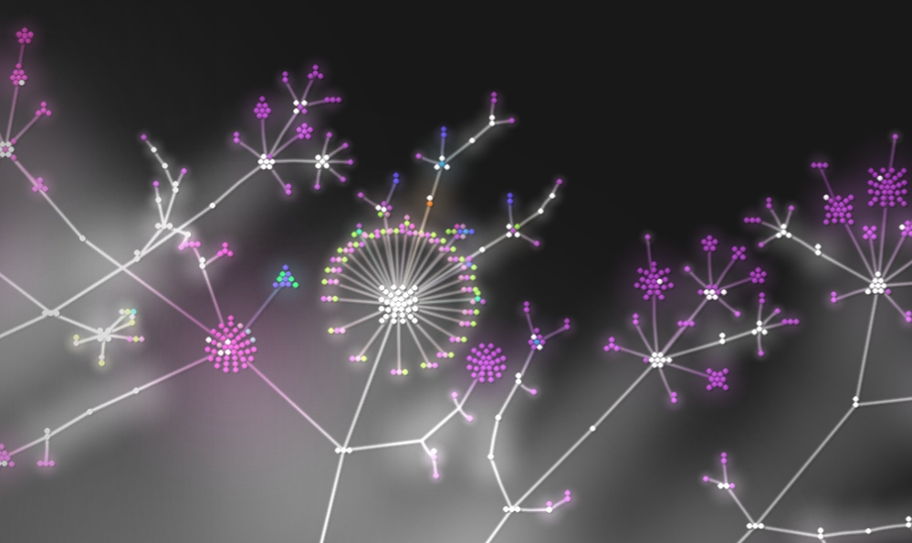

# Gource video

Create a git evolution video by:

``` bash
gource -1280x720 --title "Project Name" --date-format "%Y-%B-%d" --font-size 20 --font-colour ead02f --key -s 0.22 -disable-progress -stop-at-end --auto-skip-seconds 0.22 \ -highlight-all-users --highlight-colour ead02f -user-scale 3 --max-file-lag 0.1 --max-user-speed 200 --dir-name-depth 4 --dir-name-position 0.8 --hide filenames, -r 60 -o - | \ ffmpeg -y -r 60 -f image2pipe -vcodec ppm -i - -vcodec wmv1 -r 60 -qscale 0 out.wmv
```

[https://gource.io](https://gource.io)

