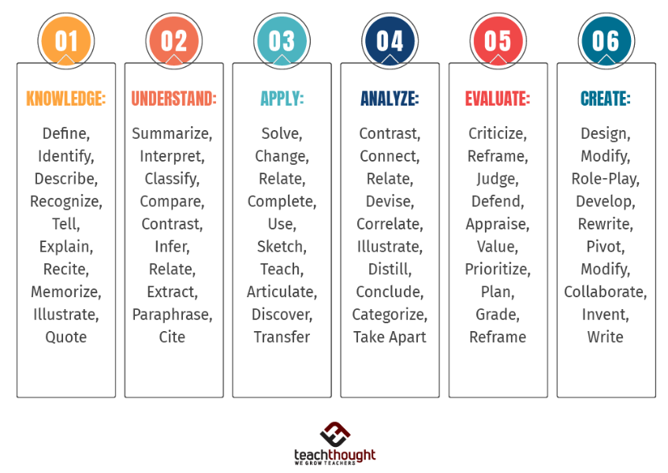

# Bloom's Taxonomy

Bloom's Taxonomy is a framework that categorizes educational goals into levels of complexity and specificity. It helps educators design learning experiences that promote higher-order thinking skills. The taxonomy is divided into six levels, from the simplest to the most complex:

- Remember
- Understand
- Apply
- Analyze
- Evaluate
- Create

Examples of activities that correspond to each level include:

1. Start with Remembering: Ensure students can recall basic facts and concepts.
`Activity: Flashcards for programming syntax.`
  
2. Move to Understanding: Help students explain and interpret these concepts.  
`Activity: Group discussions on how different code snippets work.`

3. Apply Knowledge: Encourage students to use their knowledge in practical scenarios.
`Activity: Coding exercises that require implementing learned concepts.`

4. Analyze Information: Teach students to break down complex problems and see relationships.  
`Activity: Code reviews and debugging sessions.`

5. Evaluate Solutions: Guide students to assess and critique their own and others' work.
`Activity: Peer reviews and performance analysis of different code solutions.`

6. Create New Work: Challenge students to design and build new projects.
`Activity: Capstone projects or hackathons where they create software applications.`

