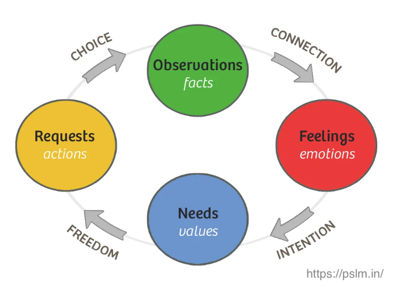

# Communication

### Give feedback

[Video](https://www.youtube.com/watch?v=wtl5UrrgU8c&t=2s)

1. Start with a micro-yes question to prepare brain to receive feeback! e.g., ***I have some good ideas for... can I share them with you?***
2. Data driven feedback: e.g. ***I noticed you did not attend to the meeting... instead of "you are unreliable"*** be specific about facts and data, no opinions or absoulte sentences.
3. Provide meaning about the impact of the previous data: e.g. ***due that, we could not move forward... or that made us feel like you do not care about the team.***
4. End with a question or CTA: e.g. ***What do you think if from now on...?***

### Conflict resolution - Non violent communication (NVC)

[Video](https://www.youtube.com/watch?v=3l8l4prc-_Q)

1. **Observations**: facts without judgment
2. **Feeling**: how you feel in relation to what you observe
3. **Need**: what you need or value that causes your feeling
4. **Request**: a specific request of what you would like to see happen

