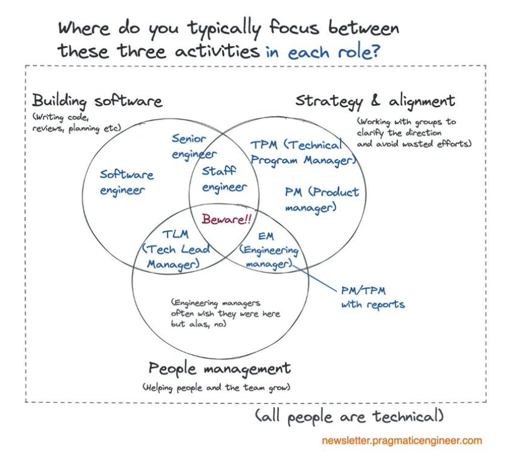

# Manager Role

:::warning
If you're going to be a manager, make sure you can stand behind the org leadership, the product, and the company goals.
:::

As a software engineer, you can work in an organization where you don't particularly like the leadership team, don't love the product, or aren't aligned with the goals, and it can still be 'okay', it's just a job. As a manager, you can't — or at least, you shouldn't. These conflicts will eat you up inside and prevent you from doing good work. ***Your role is to represent the leadership team, align people with the company's goals, and drive the mission forward by empowering your team.***

You are the face of the organization to your team, so if you can't fully support the org leadership and their decisions, you won't be able to do your job effectively. You can't distance yourself from the organization and criticize it, saying things like, 'they told me to tell you this, but I don't agree with it...'. That only serves to undermine your position.

Other things to consider:

- you should learn ~~as much as you can~~ a bit about everything.
- you should be able to communicate with everyone.
- you should be able to understand the company business and how the team contributes to it.
- instead of being obsessed with goals, be obssesed with a system that gets you there.

And very importat: forget about instant rewards and be mindful of yourself!

